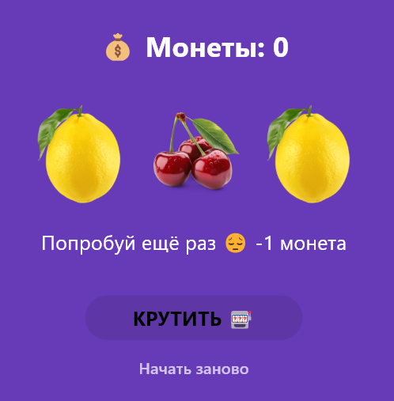
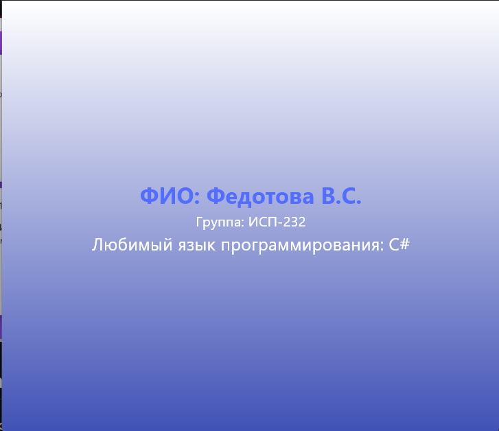

# Лабораторная работа №6. Flutter: StatefulWidget и управление состоянием

ФИО: Федотова В.С.

Группа: ИСП-232

Дата: 27.04.26

---

## Что изучили

- Разницу между StatelessWidget и StatefulWidget
- Научиться управлять состоянием приложения через setState()
- Подключать локальные изображения и обрабатывать нажатия кнопок — на примере слот-машины

## Скриншоты

## Инструкция по запуску

1. Скачать репозиторий с [Github](https://github.com/vfedotova418-png/Flutter_Lab6.git)
2. Установить зависимости: `flutter pub get`
3. Запустить через браузер: `flutter run -d <браузер>` или `flutter run`
